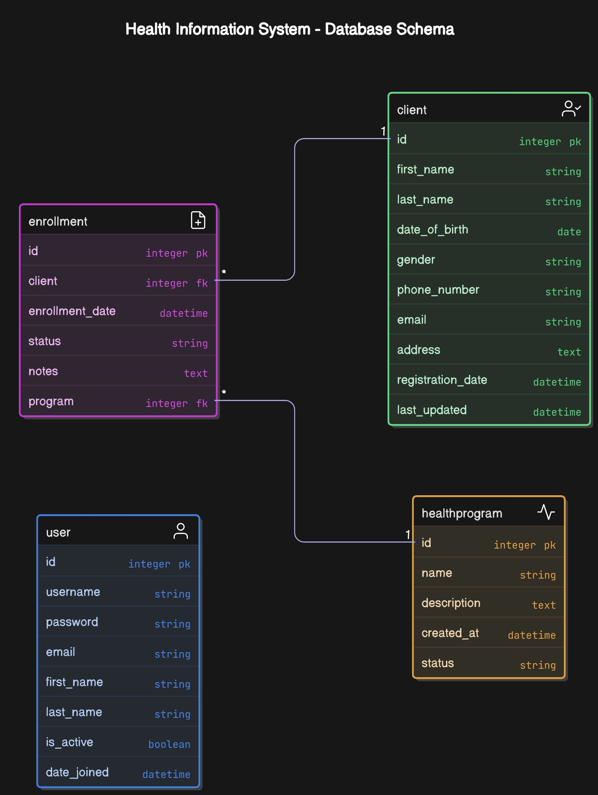

# Health Information System
## Modern Solution for Healthcare Management

---

## Contents

1. Project Overview
2. Problem Statement & Objectives
3. Approach & Methodology
4. Technology Stack
5. System Architecture
6. Database Design
7. Key Features
8. Implementation Highlights
9. UI/UX Design
10. Security Measures
11. Challenges & Solutions
12. Future Enhancements
13. Conclusion

---

## Project Overview

- Comprehensive health information management system
- Digital transformation of healthcare operations
- Secure patient data management
- Streamlined appointment scheduling
- Electronic health records management
- Billing and insurance integration

---

## Problem Statement & Objectives

### Problems in Traditional Systems:
- Paper-based record keeping
- Difficulty in cross-department information sharing
- Manual appointment scheduling leading to errors
- Security and privacy concerns
- Limited access to historical patient data

### Objectives:
- Create a unified platform for all healthcare operations
- Improve data accessibility while maintaining security
- Enhance patient care through better information flow
- Reduce administrative overhead
- Enable data-driven decision making

---

## Approach & Methodology

- Agile development process
- User-centered design approach
- Iterative development and testing
- Microservices architecture
- Continuous integration and deployment
- Regular stakeholder feedback

---

## Technology Stack

### Backend:
- Python 3.8+
- Django 5.0 (Web framework)
- Django REST Framework (API)
- SQLite (Database, can be migrated to PostgreSQL)

### Frontend:
- HTML5, CSS3, JavaScript
- Bootstrap 5 (Responsive design)
- AJAX for asynchronous data loading

### Tools:
- Git (Version control)
- GitHub (Repository hosting)
- VS Code (Development environment)

---

## System Architecture

- Microservices-based architecture
- API Gateway for request routing
- Service-specific databases
- Authentication and authorization services
- Real-time notifications

---

## Database Design

- MongoDB collections structure
- Relationships between entities
- Indexing strategy
- Data validation rules

---

## Key Features

### Patient Management
- Patient registration and profiles
- Medical history tracking
- Document uploads (test results, prescriptions)

### Appointment System
- Online scheduling
- Reminders and notifications
- Calendar integration

### Electronic Health Records
- Digital charts and notes
- Medical history documentation
- Test results management

### Billing & Insurance
- Insurance verification
- Automated billing
- Payment processing
- Financial reporting

---

## Implementation Highlights

- Secure authentication system
- Role-based access control
- Real-time updates using WebSockets
- Offline data synchronization
- Comprehensive API documentation
- Extensive unit and integration testing

---

## UI/UX Design

- Clean, intuitive interface
- Consistent design language
- Accessibility compliance
- Mobile-responsive design
- User flow optimization

---

## Security Measures

- End-to-end encryption
- HIPAA compliance
- Regular security audits
- Data anonymization for analytics
- Detailed access logging
- Two-factor authentication

---

## Challenges & Solutions

### Challenges:
- Complex data relationships
- Performance with large datasets
- Security compliance requirements
- Integration with existing systems

### Solutions:
- Optimized database schema
- Implemented caching strategies
- Comprehensive security framework
- Custom API adapters for legacy systems

---

## Future Enhancements

- AI-powered diagnostic assistance
- Telemedicine integration
- Mobile application development
- Advanced analytics dashboard
- Integration with wearable devices
- International language support

---

## Conclusion

- Successfully delivered comprehensive health information system
- Modern architecture ensures scalability and maintainability
- Improved efficiency of healthcare operations
- Enhanced patient experience
- Secure and compliant solution
- Platform for future healthcare innovation

---

## Thank You
### Questions & Answers 